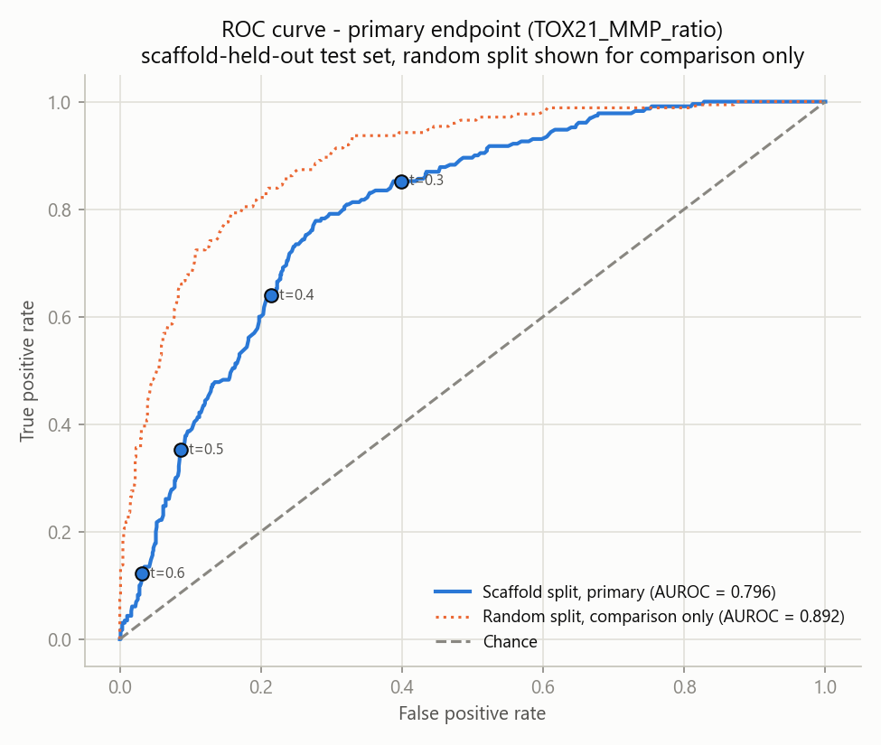
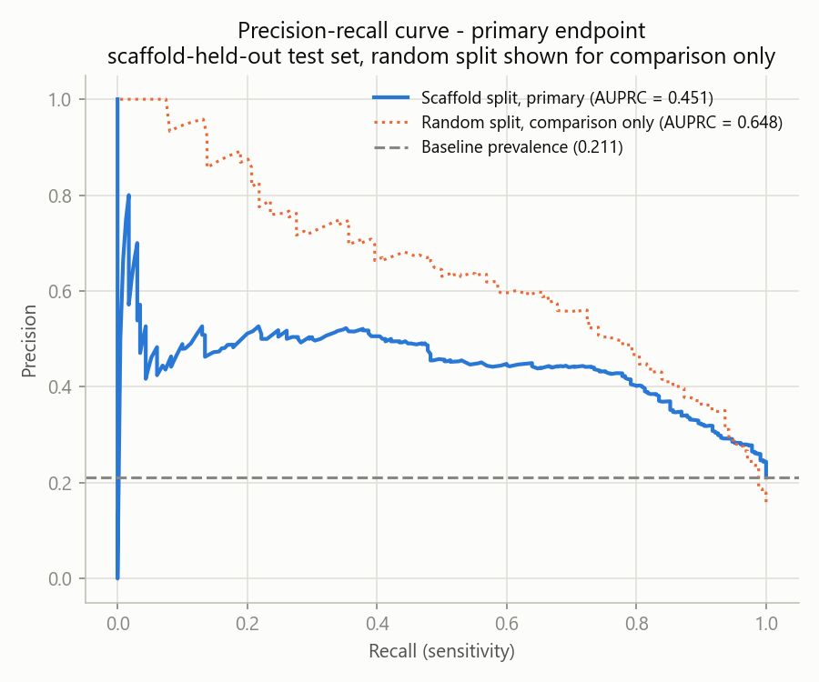
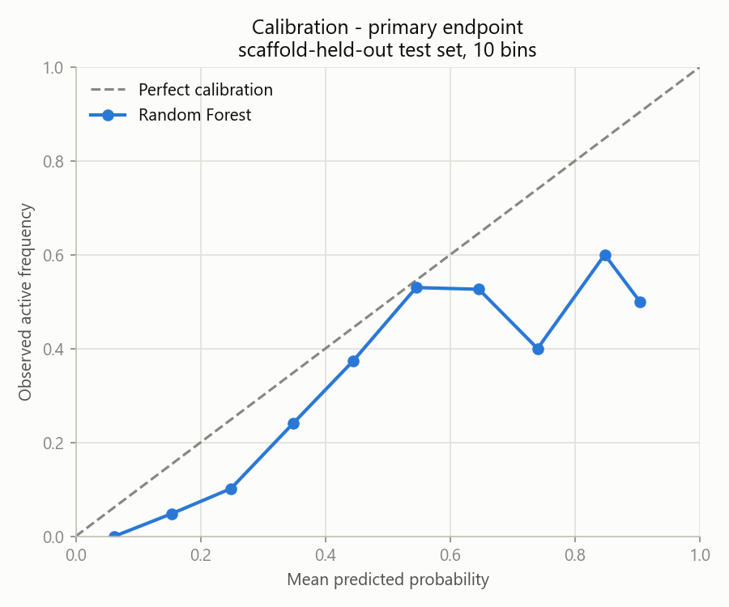
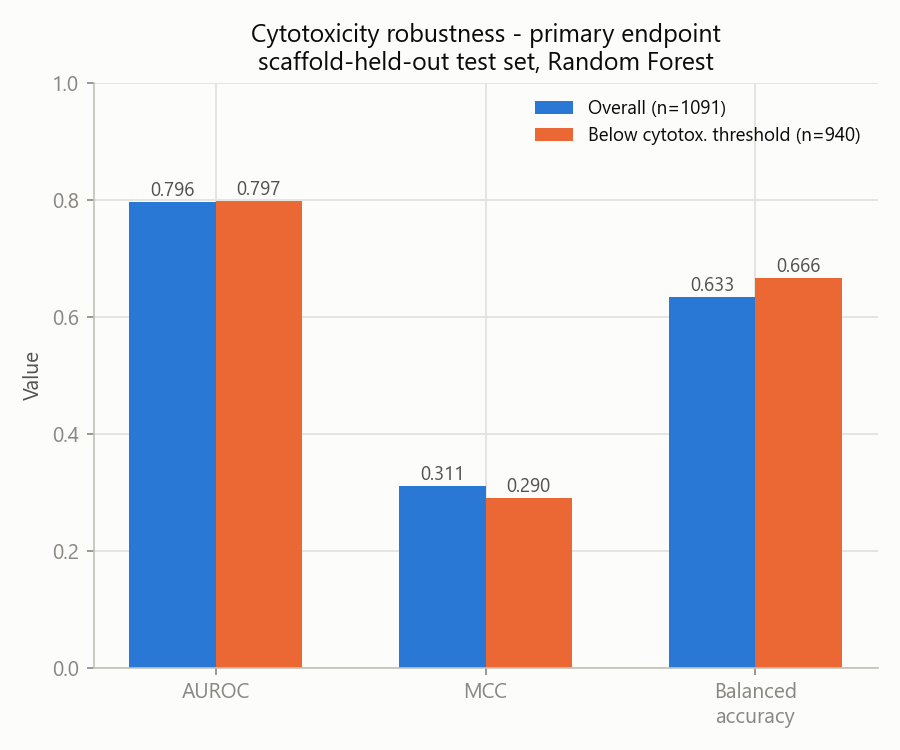
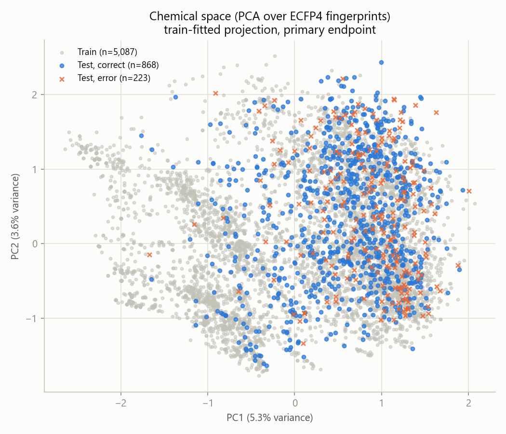
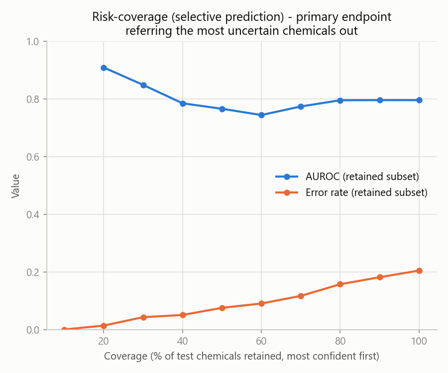
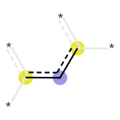
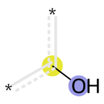
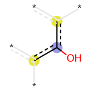

# Step 2 results (primary endpoint: TOX21_MMP_ratio, aeid 1854)

Locked per `docs/endpoint_definitions.md` (Kolliputi review, 2026-08-12). Positive-hit
rule and cytotoxicity filtering rule were documented there *before* any model was run.
Scaffold-separated split is the primary evaluation; random split is reported only as
a comparison, per instruction. Locked test set was never used for feature selection,
threshold tuning, endpoint definition, or model optimization.

## Dataset and split
- 7,268 chemicals tested on the primary endpoint (1,158 active, 15.9%)
- Bemis-Murcko scaffold-separated split: 5,087 train / 1,090 val / 1,091 test
  (no scaffold appears in more than one partition - verified programmatically)
- Stratified random split, same proportions, for comparison only
- Label definition (from docs/endpoint_definitions.md): ToxCast hitcall >= 0.9 = active
- Model decision threshold: predicted probability >= 0.5 for all threshold-dependent
  metrics below (sensitivity, specificity, F1, MCC, confusion matrix) - a fixed default,
  chosen before running any evaluation, not tuned on val or test

## Hyperparameter selection (val-set AUROC only, never test)

| regime | model | best params | val AUROC |
|---|---|---|---|
| scaffold | logistic_regression | {"C": 0.01} | 0.689 |
| scaffold | random_forest | {"max_depth": null} | 0.777 |
| scaffold | xgboost | {"max_depth": 9} | 0.779 |
| random | logistic_regression | {"C": 0.01} | 0.797 |
| random | random_forest | {"max_depth": null} | 0.891 |
| random | xgboost | {"max_depth": 3} | 0.881 |

## Locked test-set performance: scaffold split (primary) vs random split (comparison)

| regime | model | n | n active | AUROC | AUPRC | sensitivity | specificity | balanced acc | F1 | MCC | Brier |
|---|---|---|---|---|---|---|---|---|---|---|---|
| random | random_forest | 1091 | 174 | 0.892 | 0.648 | 0.626 | 0.919 | 0.773 | 0.611 | 0.535 | 0.098 |
| random | xgboost | 1091 | 174 | 0.879 | 0.628 | 0.764 | 0.821 | 0.793 | 0.565 | 0.482 | 0.126 |
| random | logistic_regression | 1091 | 174 | 0.802 | 0.492 | 0.569 | 0.863 | 0.716 | 0.496 | 0.391 | 0.135 |
| scaffold | random_forest | 1091 | 230 | 0.796 | 0.451 | 0.352 | 0.914 | 0.633 | 0.421 | 0.311 | 0.148 |
| scaffold | xgboost | 1091 | 230 | 0.763 | 0.458 | 0.487 | 0.854 | 0.670 | 0.479 | 0.336 | 0.162 |
| scaffold | logistic_regression | 1091 | 230 | 0.673 | 0.342 | 0.365 | 0.832 | 0.598 | 0.366 | 0.197 | 0.213 |

### Confusion matrices (at predicted probability >= 0.5)

| regime | model | TN | FP | FN | TP |
|---|---|---|---|---|---|
| random | random_forest | 843 | 74 | 65 | 109 |
| random | xgboost | 753 | 164 | 41 | 133 |
| random | logistic_regression | 791 | 126 | 75 | 99 |
| scaffold | random_forest | 787 | 74 | 149 | 81 |
| scaffold | xgboost | 735 | 126 | 118 | 112 |
| scaffold | logistic_regression | 716 | 145 | 146 | 84 |

**Best model: random_forest** (highest scaffold-test AUROC). Random-split AUROC (0.892) is meaningfully higher than scaffold-split AUROC (0.796) for the same model - the expected pattern when a random
split leaks structural similarity between train and test; the scaffold-split number is
the honest estimate of performance on genuinely novel chemical scaffolds.

*(Transparency note: all three models' hyperparameters were selected using only the val
set, per instruction. Which of the three already-fixed models gets the deeper follow-up
analysis below - uncertainty/AD, Seahorse concordance - is chosen by test-set AUROC here,
since some single model has to be picked for those; no hyperparameter, threshold, or
endpoint definition was changed based on that choice, and all three models' full test
metrics are reported above regardless of which one is picked.)*

### Threshold tradeoff (scaffold Random Forest, locked test set)

0.5 was the pre-declared default threshold used for every headline metric above,
chosen before any evaluation ran. The table below shows the same locked predictions
at other thresholds, to demonstrate the operating point is tunable rather than fixed
to a single number - no result above was re-computed or re-selected based on this:

| threshold | sensitivity | specificity | balanced acc | F1 |
|---|---|---|---|---|
| 0.3 | 0.852 | 0.602 | 0.727 | 0.510 |
| 0.4 | 0.639 | 0.785 | 0.712 | 0.523 |
| 0.5 | 0.352 | 0.914 | 0.633 | 0.421 |
| 0.6 | 0.126 | 0.969 | 0.547 | 0.203 |

Lower thresholds trade specificity for sensitivity (0.3: catches 85% of actives at the
cost of a 40% false-positive rate among inactives); higher thresholds do the reverse.
0.4 happens to edge out 0.5 on both balanced accuracy and F1 here - reported for
completeness, not adopted as a new headline number after the fact.

**Per Kolliputi:** 0.5 is not to be treated as the required product threshold. Since
MitoTox AI is intended as a screening/prioritization tool, a final operating threshold
may instead be selected on the validation set to prioritize sensitivity, then locked
before test/prospective evaluation - that selection has not been made yet; the table
above exists to show the tradeoff is real and tunable, not to pre-commit to one.

## Calibration

10-bin calibration table for the best model (random_forest, scaffold-test set) - mean
predicted probability vs. observed active frequency within each bin (see Brier scores
in the table above for all six model/regime combinations):

| bin | n | mean predicted | observed frequency |
|---|---|---|---|
| 0.0-0.1 | 124 | 0.062 | 0.000 |
| 0.1-0.2 | 186 | 0.154 | 0.048 |
| 0.2-0.3 | 246 | 0.249 | 0.102 |
| 0.3-0.4 | 203 | 0.349 | 0.241 |
| 0.4-0.5 | 177 | 0.444 | 0.373 |
| 0.5-0.6 | 100 | 0.545 | 0.530 |
| 0.6-0.7 | 38 | 0.646 | 0.526 |
| 0.7-0.8 | 10 | 0.740 | 0.400 |
| 0.8-0.9 | 5 | 0.848 | 0.600 |
| 0.9-1.0 | 2 | 0.904 | 0.500 |

Full calibration bins for all six model/regime combinations in
`data/processed/step2_calibration_bins.csv`.

## Cytotoxicity-aware sensitivity analysis

Filtering rule (documented before running): drop test-set rows where label==1 AND the
chemical's hit is at/above its own cytotoxicity burst threshold
(`mmp_ratio_tox21_cytotox_confound`). All negatives are kept - the confound flag only
applies to actives.

| regime | model | subset | n | AUROC | MCC | balanced acc |
|---|---|---|---|---|---|---|
| random | logistic_regression | below_cytotox_threshold | 995 | 0.846 | 0.347 | 0.745 |
| random | logistic_regression | overall | 1091 | 0.802 | 0.391 | 0.716 |
| random | random_forest | below_cytotox_threshold | 995 | 0.908 | 0.491 | 0.806 |
| random | random_forest | overall | 1091 | 0.892 | 0.535 | 0.773 |
| random | xgboost | below_cytotox_threshold | 995 | 0.898 | 0.403 | 0.814 |
| random | xgboost | overall | 1091 | 0.879 | 0.482 | 0.793 |
| scaffold | logistic_regression | below_cytotox_threshold | 940 | 0.687 | 0.177 | 0.625 |
| scaffold | logistic_regression | overall | 1091 | 0.673 | 0.197 | 0.598 |
| scaffold | random_forest | below_cytotox_threshold | 940 | 0.797 | 0.290 | 0.666 |
| scaffold | random_forest | overall | 1091 | 0.796 | 0.311 | 0.633 |
| scaffold | xgboost | below_cytotox_threshold | 940 | 0.756 | 0.262 | 0.680 |
| scaffold | xgboost | overall | 1091 | 0.763 | 0.336 | 0.670 |

**For the best model (random_forest, scaffold split): predictive performance persists** when restricted to hits below the cytotoxicity burst threshold (AUROC 0.796 overall vs 0.797 below-threshold, n=940) - evidence the signal is not simply tracking general cytotoxicity.

## Uncertainty and domain of applicability

Best model (random_forest, scaffold split). Uncertainty = std of predicted probability
across the forest's 500 trees. Domain of applicability = 1 - nearest-neighbor Tanimoto
similarity to the scaffold-train fingerprints.

- 223/1091 test predictions (20.4%) are errors at the 0.5 threshold.
- **Uncertainty is significantly higher among errors** (mean 0.4750 vs 0.4088 for correct predictions, one-sided Mann-Whitney p=2.517e-33) - errors are enriched among high-uncertainty predictions.
- AD novelty is *not* significantly different between errors and correct predictions (mean 0.5931 vs 0.6010, p=0.5667) - structural distance to
  the training set alone does not predict errors as well as the model's own internal
  disagreement does. Reported as-is; not every diagnostic needs to show a signal to be honest.

PCA over ECFP4 fingerprints (fit on train, test chemicals projected in) - note PC1+PC2
explain only ~8.9% of variance, typical for sparse high-dimensional fingerprints, so this
is a coarse 2D view of a much higher-dimensional space. Consistent with the statistical
finding above: test errors (orange x) don't visually separate into a distinct region from
correct predictions (blue) - the model's own uncertainty is a better error signal than
position in this projection.

### Risk-coverage (selective prediction)

**Terminology, made explicit after an earlier mislabeling:** "coverage" = the % of test
chemicals *retained* (the most confident ones, ranked by ascending forest-disagreement
uncertainty). The rest are *referred* for experimental confirmation (the most uncertain
ones). An earlier draft of this section described "referring the most uncertain 20%,
retaining 80%" as giving AUROC 0.909 / 1.4% error - that was backwards. Those numbers are
the *20% coverage* row below (retain only the most-confident 20%, refer the other 80%).
The retain-80%/refer-uncertain-20% operating point is the *80% coverage* row: AUROC 0.796,
15.7% error - a much smaller improvement over the no-referral baseline than originally
reported. Kolliputi flagged this discrepancy directly; full corrected table below.

| coverage (retained) | n retained | n referred | % referred | AUROC | AUPRC | sensitivity | specificity | balanced acc | error rate |
|---|---|---|---|---|---|---|---|---|---|
| 100% | 1091 | 0 | 0.0% | 0.796 | 0.451 | 0.352 | 0.914 | 0.633 | 0.204 |
| 90% | 982 | 109 | 10.0% | 0.796 | 0.424 | 0.302 | 0.934 | 0.618 | 0.181 |
| 80% | 873 | 218 | 20.0% | 0.796 | 0.397 | 0.241 | 0.951 | 0.596 | 0.157 |
| 70% | 764 | 327 | 30.0% | 0.776 | 0.343 | 0.261 | 0.964 | 0.613 | 0.116 |
| 60% | 655 | 436 | 40.0% | 0.743 | 0.268 | 0.214 | 0.975 | 0.595 | 0.090 |
| 50% | 546 | 545 | 50.0% | 0.764 | 0.274 | 0.195 | 0.984 | 0.590 | 0.075 |
| 40% | 436 | 655 | 60.0% | 0.785 | 0.280 | 0.269 | 0.993 | 0.631 | 0.050 |
| 30% | 327 | 764 | 70.0% | 0.848 | 0.327 | 0.267 | 0.990 | 0.629 | 0.043 |
| 20% | 218 | 873 | 80.0% | 0.909 | 0.482 | 0.667 | 0.995 | 0.831 | 0.014 |

**At 80% coverage (referring the most uncertain 20% for experimental confirmation) -** the
operating point Kolliputi asked to see specifically as the more commercially realistic one:
AUROC 0.796, sensitivity 0.241, specificity 0.951, error rate 0.157 (15.7%),
versus 20.4% with no
referral at all - a real but modest improvement, not the dramatic one in the earlier draft.
At the far more conservative 20% coverage (referring 80%), error rate drops to 1.4% - useful context, but not the number that answers
"what if we refer roughly a fifth of chemicals."

## Explainability examples

SHAP (TreeExplainer, interventional mode against a train background sample) on the
scaffold Random Forest, for three representative chemicals. Fingerprint-bit features are
rendered as the actual substructure driving that bit, not left as an opaque bit index.

### Correctly predicted mitochondrial liability (true positive)
DTXSID `DTXSID3042631` - predicted probability 0.900, true label active, uncertainty (tree-disagreement std) 0.300

Top contributing features (SHAP value, feature value):

- `logp`: SHAP=0.101, value=4.79
- `aromatic_rings`: SHAP=0.066, value=2
- `mol_weight`: SHAP=0.054, value=292
- `heavy_atoms`: SHAP=0.045, value=19
- `ecfp4_875`: SHAP=0.034, value=1

### Correctly predicted low liability (true negative)
DTXSID `DTXSID8025969` - predicted probability 0.002, true label inactive, uncertainty (tree-disagreement std) 0.045

Top contributing features (SHAP value, feature value):

- `mol_weight`: SHAP=-0.044, value=58.1
- `logp`: SHAP=-0.027, value=0.407
- `heavy_atoms`: SHAP=-0.022, value=4
- `aromatic_rings`: SHAP=-0.014, value=0
- `fraction_csp3`: SHAP=-0.013, value=1

### Highest-uncertainty prediction (most disagreement across trees)
DTXSID `DTXSID9048984` - predicted probability 0.500, true label active, uncertainty (tree-disagreement std) 0.500

Top contributing features (SHAP value, feature value):

- `logp`: SHAP=0.071, value=4.39
- `aromatic_rings`: SHAP=0.062, value=4
- `ecfp4_1602`: SHAP=0.043, value=1
- `mol_weight`: SHAP=0.043, value=388
- `ecfp4_202`: SHAP=0.038, value=1

## Seahorse orthogonal concordance

The random_forest model applied to all 253 chemicals with Seahorse respirometry data,
compared against each Seahorse hit call. **Important caveat (independent audit finding):**
60.5% of these 253 chemicals (153) were in this model's own scaffold-train set - not a
true validation for those, since the model saw their primary-endpoint labels during
training (though never their Seahorse labels). Stratified below rather than blended,
since the blended number is inflated by in-sample predictions.

| membership | Seahorse endpoint | n | AUROC (MMP model vs Seahorse) | agreement @0.5 |
|---|---|---|---|---|
| blended (all 253, includes in-sample train chemicals) | primary_basal_resp_rate | 253 | 0.628 | 0.553 |
| blended (all 253, includes in-sample train chemicals) | primary_max_resp_rate | 253 | 0.622 | 0.549 |
| blended (all 253, includes in-sample train chemicals) | primary_inhib_resp_rate | 253 | 0.520 | 0.573 |
| in_scaffold_train (in-sample, not a true validation) | primary_basal_resp_rate | 153 | 0.672 | 0.654 |
| in_scaffold_train (in-sample, not a true validation) | primary_max_resp_rate | 153 | 0.669 | 0.621 |
| in_scaffold_train (in-sample, not a true validation) | primary_inhib_resp_rate | 153 | 0.552 | 0.503 |
| held_out (val+test+untested-on-primary - genuine orthogonal signal) | primary_basal_resp_rate | 100 | 0.470 | 0.400 |
| held_out (val+test+untested-on-primary - genuine orthogonal signal) | primary_max_resp_rate | 100 | 0.558 | 0.440 |
| held_out (val+test+untested-on-primary - genuine orthogonal signal) | primary_inhib_resp_rate | 100 | 0.508 | 0.680 |

**The genuinely held-out subset (n=100) shows near-chance concordance (AUROC 0.470-0.558)** - meaningfully weaker than the
in-sample/blended numbers suggest. Read honestly: this primary MMP model does not show
strong evidence of predicting Seahorse-measured bioenergetic disruption in chemicals it
wasn't trained on. Membrane-potential disruption and direct respirometry impairment may
be more mechanistically distinct than initially assumed, or n=100 held-out Seahorse
chemicals is simply too small to detect a real but modest effect - this analysis cannot
distinguish between those two explanations. **Decision (Kolliputi):** no further effort
will go into forcing concordance between the two. The weak concordance itself supports
treating mitochondrial membrane-potential liability and respiratory/bioenergetic
dysfunction as distinct mitochondrial phenotype modules rather than one composite
endpoint - that design choice carries into Aim 2's scope, not just a caveat here.

## External validation (exploratory only - not a Phase I substitute)

Per Kolliputi: report the overlap analysis transparently, but this is an **exploratory**
analysis, not definitive external validation - the class balance below is too extreme for
that. Rigorous external validation (a larger, better-balanced, structure-checked
independent set, or a prospective panel) is reserved for Phase I.

See `docs/external_validation_search.md` for the full source-by-source breakdown.
Summary: a literature-curated membrane-potential dataset independent of Tox21 was
identified (147 compounds), and the locked model was applied to it without retraining.
82% (120/146) turned out to already be in our own training population - itself a useful finding about how much apparent 'independent' datasets can overlap with ToxCast once checked at the structure level. Of the **26 genuinely unseen chemicals** that remained, the label balance was 25 active / 1 inactive - too few negatives for a reliable estimate. Exploratory result (AUROC 0.720, balanced accuracy 0.680) is reported for transparency, not presented as a validated finding.

## Repro notes
- All models trained with fixed random_state=42.
- Scaffold split verified to have zero scaffold overlap across train/val/test.
- Trained model artifacts: `models/{scaffold,random}_{logistic_regression,random_forest,xgboost}.joblib`.
